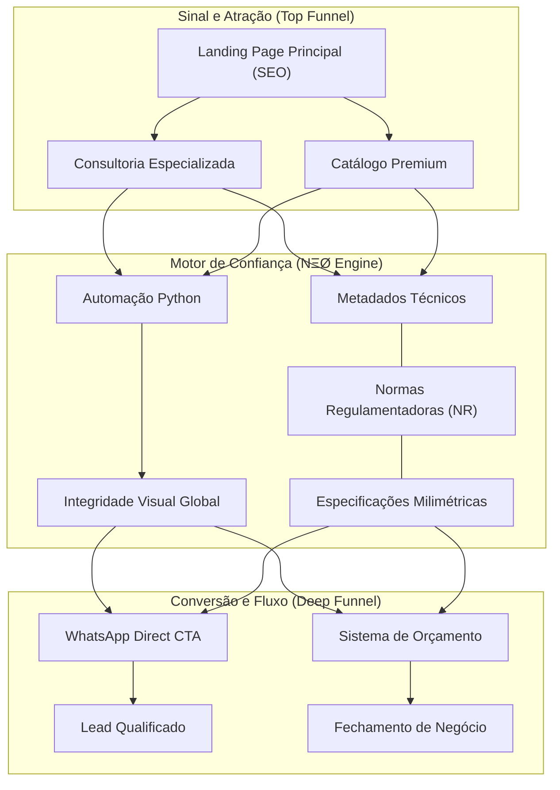

# 4Safety — Soluções Técnicas e Catálogo de Segurança

> **Relatório de Projeto e Ativos de Marca**  
> **Status**: Pronto para Produção (Ambiente Homologado)  
> **Protocolo**: NΞØ Protocol (Segurança e Build Automatizado)

O projeto 4Safety é uma plataforma digital de alto desempenho focada em **Segurança do Trabalho e Auditoria Técnica**. Diferente de sites institucionais comuns, este ecossistema foi construído sobre uma base de automação robusta, garantindo que o catálogo de produtos e as landing pages de consultoria permaneçam sincronizadas, seguras e visivelmente premium.

---

## 🏗 Arquitetura do Ecossistema

O diagrama abaixo ilustra como os sinais de entrada (necessidade do cliente) são processados pela nossa infraestrutura para gerar confiança e conversão.

---

## 💎 Destaques do Entregável

### 1. Design de Alta Fidelidade (Premium UI)
Utilizamos uma estética baseada em **Glassmorphism** e **Modern Industrial UX**, com tipografia clara e carregamento progressivo (Scroll Reveal), garantindo que a autoridade da 4Safety seja percebida no primeiro segundo de navegação.

### 2. Catálogo Automatizado
O catálogo (11+ produtos iniciais) não é editado manualmente. Ele é gerado por um **sistema de templates inteligentes**, o que permite que novas linhas de produto sejam adicionadas em segundos, mantendo 100% da identidade visual em todas as páginas.

### 3. Segurança e Compliance (NΞØ Protocol)
Todas as páginas passam por um processo rigoroso de:
- **Auditoria contra vulnerabilidades**: Nível zero de riscos detectados.
- **Validação Semântica**: Código leve, otimizado para Google (SEO) e acessibilidade.
- **Entrega Contínua (CI/CD)**: Publicação automática via Vercel, garantindo que o site esteja sempre no ar na versão mais recente.

---

## 📂 Ativos Entregues

- **Ambiente de Destino (Root)**: Landing Page, Quem Somos e Consulta CA.
- **Ambiente de Catálogo (`produtos/`)**: Detecção de Gás, Altura, Respiratório, etc.
- **Ambiente de Suporte (`docs/`)**: Guias de copy, tokens de design e estratégia de marca.

---

## ⚙️ Administração do Projeto

Para instruções técnicas de desenvolvedor, configuração de ambiente e manutenção dos scripts de automação, consulte o arquivo:
👉 **[SETUP.md](./SETUP.md)**

---
*Este projeto é mantido sob os padrões de excelência por Antigravity AI Agent (NΞØ Protocol).*
